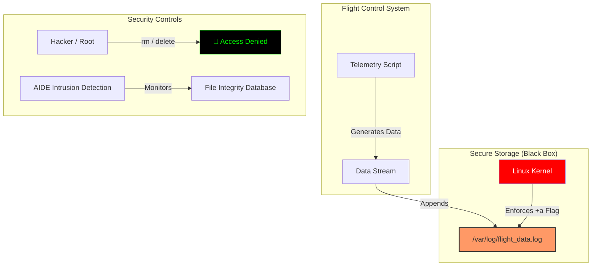

# ✈️ Secure Flight Data Recorder (Simulated)

## 📋 Project Overview
> *"In safety-critical aviation systems, flight logs must be indestructible. I applied this 'Black Box' concept to a Linux server environment."*

This project implements a **Simulated Flight Data Recorder (FDR)** that captures real-time telemetry (Altitude, Speed, Coordinates). The storage mechanism is engineered to be **Immutable** (Write-Once, Read-Many) using Linux Kernel attributes, ensuring that logs cannot be tampered with or deleted—even by the Root user.

## 🏗️ System Architecture
The system uses a custom Bash daemon to generate telemetry, which is then secured by the Linux filesystem's extended attributes.

🛡️ Security Controls (NIST SP 800-53)

1. Information Integrity (SI-10)
Technique: chattr +a (Append Only).
Benefit: Ensures that flight data, once written, becomes immutable. It prevents "History Rewriting" attacks where bad actors wipe logs to cover their tracks.

2. Intrusion Detection (SI-4)
Technique: AIDE (Advanced Intrusion Detection Environment).
Benefit: Creates a cryptographic hash database of the file system. Any unauthorized change (even 1 bit) triggers an integrity violation alert.

3. Least Privilege
Technique: The telemetry script runs as a background daemon, while write access to the log directory is strictly controlled via file system attributes.

🛠️ Reproduction Steps
1. The Simulation Script (flight_telemetry.sh)
#!/bin/bash
while true; do
    echo "[$TIMESTAMP] FLIGHT_ID: AX-770 | ALT: $((10000 + RANDOM % 500))" >> /var/log/flight_data.log
    sleep 5
done

2. Locking the "Black Box"
# Apply Immutable Attribute (Append Only)
sudo chattr +a /var/log/flight_data.log

# Verify the Lock
lsattr /var/log/flight_data.log
# Output: -----a-------

3. The "Hacker" Test
# Attempt to delete the logs
sudo rm /var/log/flight_data.log
# Result: rm: cannot remove ... Operation not permitted

        
        AIDE[AIDE Intrusion Detection] -- Monitors --> Hash[File Integrity Database]
    end
